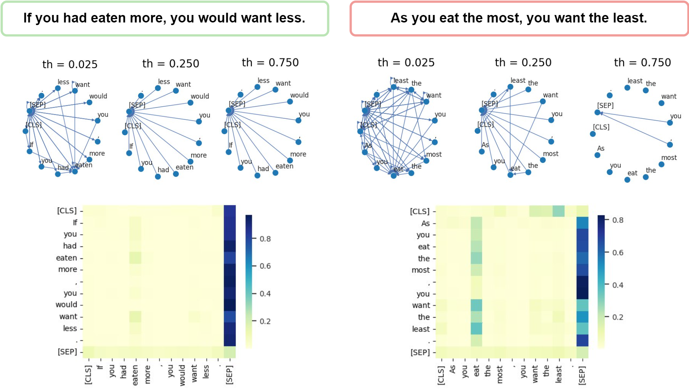

# Can BERT eat RuCoLA? Topological Data Analysis to Explain

This repository contains code for the paper _Can BERT eat RuCoLA? Topological Data Analysis to Explain_ accepted to Slavic NLP 2023.

In the paper we investigate how Transformer language models (LMs) fine-tuned for acceptability classification capture linguistic features. Our approach uses the best practices of topological data analysis (TDA) in NLP: we construct directed attention graphs from attention matrices, derive topological features from them, and feed them to linear classifiers.
We introduce **new topological features**, suggest a **new TDA-based approach for measuring the distance between pre-trained and fine-tuned LMs** with large and base configurations, and determine the **roles of attention heads** in the context of LA tasks in Russian and English.  
___

Attention graphs for acceptable (left) and unacceptable (right) sentences with corresponding attention matrices, extracted from BERT (Layer, Head: [9,5]).
<p align="center">

</p>

# Usage

* Use ```1_Fine-tuning_example.ipynb``` for training LM on LA (Russian or English) task.
* Use ```2_1_Topological_and_template_features_calculation.ipynb```  and ```2_2_Ripser_features.ipynb``` for computing features.
* Use ```3_1_Topological_features_distance.ipynb```  and ```3_2_JS_divergence_distance.ipynb``` to measure fine-tuning effect with TDA feature distance and JS Shennon divergence.
* Use ```4_TDA_acceptability_classification.ipynb``` for acceptability judgements classification with TDA features.
* Use ```5_Head_importance.ipynb``` to evaluate per-sample confidence and estimate head and feature importances per violation group and per-sample.

We conduct all the experiments on monolingual encoders fine-tuned on grammatical acceptability corpora in [English](https://github.com/nyu-mll/CoLA-baselines) and [Russian](https://github.com/RussianNLP/RuCoLA).  

[Other notebooks](https://github.com/upunaprosk/la-tda/tree/master/other%20notebooks) directory contains notebooks for acceptability judgements classification with TDA features with linear feature selection, principal components importance estimation with Shapley values, and autosklearn classification example.

Consider the following related work introducing TDA-based approaches in NLP: 

* Kushnareva, L., Cherniavskii, D., Mikhailov, V., Artemova, E., Barannikov, S., Bernstein, A., Piontkovskaya, I., Piontkovski, D., & Burnaev, E. (2021). Artificial Text Detection via Examining the Topology of Attention Maps. In Proceedings of the 2021 Conference on Empirical Methods in Natural Language Processing (pp. 635–649). Association for Computational Linguistics. [[paper](https://arxiv.org/pdf/2109.04825.pdf)][[code](https://github.com/danchern97/tda4atd)]
*  Kushnareva, Laida, Dmitri Piontkovski, and Irina Piontkovskaya. "Betti numbers of attention graphs is all you really need." arXiv preprint arXiv:2207.01903 (2022). [[paper](https://arxiv.org/pdf/2207.01903.pdf)] 
* Barannikov, Serguei. "The framed Morse complex and its invariants." Advances in Soviet Mathematics 21 (1994): 93-116.* [[paper](https://hal.archives-ouvertes.fr/hal-01745109/document)] (The algorithm for the calculation of persistent barcodes (or canonical forms)) 

# Feature importance

Important features sorted by Mann-Whitney test p-value are presented [here](https://github.com/upunaprosk/la-tda/tree/master/feature_selection).

*Remark:* Results in that folder for Swedish were obtained when fine-tuning Swe-BERT on ```DaLAJ``` [dataset](https://spraakbanken.gu.se/en/resources/dalaj), for Italian, we report feature importances extracted from Ita-BERT fine-tuned on  ```ItaCoLA``` Italian [dataset](https://github.com/dhfbk/ItaCoLA-dataset).

