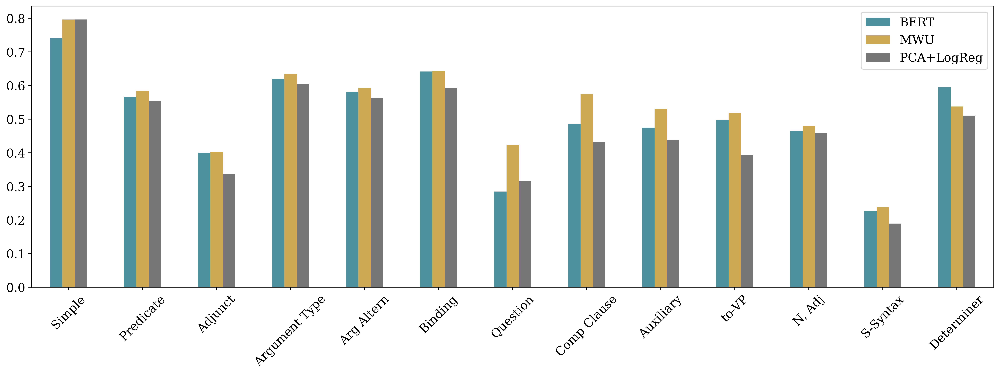
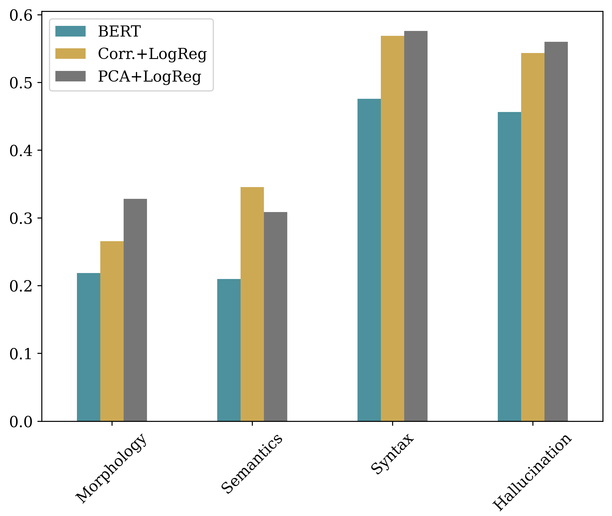

# The application of topological data analysis in the grammatical acceptability classification task

## Abstract
Pre-trained encoders have been successfully used in a variety of text classification tasks. Linguistic competence estimation, however, is still a challenging problem for transformers. For example, the Corpus of Language Acceptability (CoLA) is considered the most complicated task of the GLUE benchmark, causing inconsistent and unreliable results across tuning runs. Meanwhile, language acceptability judgements' peculiarities require confident and precise predictions on texts with linguistic phenomena, ranging from morphological to semantical.  

## Method 

We present a TDA-based interpretable feature generation approach to the acceptability classification task. We follow the methodology suggested in the following papers:

1.   Kushnareva, L., Cherniavskii, D., Mikhailov, V., Artemova, E., Barannikov, S., Bernstein, A., Piontkovskaya, I., Piontkovski, D., & Burnaev, E. (2021). Artificial Text Detection via Examining the Topology of Attention Maps. In Proceedings of the 2021 Conference on Empirical Methods in Natural Language Processing (pp. 635–649). Association for Computational Linguistics. [[paper](https://arxiv.org/pdf/2109.04825.pdf)][[code](https://github.com/danchern97/tda4atd)]
2.  Kushnareva, Laida, Dmitri Piontkovski, and Irina Piontkovskaya. "Betti numbers of attention graphs is all you really need." arXiv preprint arXiv:2207.01903 (2022). [[paper](https://arxiv.org/pdf/2207.01903.pdf)] 

The algorithm for calculation of persistent barcodes (or canonical forms) was firstly intoduced in
Barannikov, Serguei. "The framed Morse complex and its invariants." Advances in Soviet Mathematics 21 (1994): 93-116. [[paper](https://hal.archives-ouvertes.fr/hal-01745109/document)]

We use topological features of the attention graphs, features of the barcodes and attention-to-pattern features.  
We conduct all the experiments on monolingual encoders fine-tuned on grammatical acceptability corpora in [English](https://github.com/nyu-mll/CoLA-baselines), [Italian](https://github.com/dhfbk/ItaCoLA-dataset), and [Russian](https://github.com/RussianNLP/RuCoLA).  

## Acceptability classification results

**Fine-tuned setting** 
| Model             | In domain dev set |      Out of domain dev set |
|--------------|:-----------------:|:----------------:|
|              | Acc.     \| MCC | Acc.    \| MCC | 
| *En-BERT* | 0.850  \| 0.634 | 0.820    \| 0.561 | 
| En-BERT + TDA | 0.856   \| 0.654 | 0.828   \| 0.589 | 
| *Ita-BERT* | 0.867    \| 0.427 | 0.873   \| 0.468 | 
| Ita-BERT+ TDA | 0.832    \| 0.435 | 0.836    \| 0.475| 
| *Ru-BERT* |0.803    \| 0.450 | 0.732  \| 0.389 | 
| Ru-BERT+ TDA | 0.797     \| 0.465 | 0.736   \| 0.405 | 


**LMs with frozen weights setting**

| Model             | In domain dev set |      Out of domain dev set |
|--------------|:-----------------:|:----------------:|
|              | Acc.     \| MCC | Acc.    \| MCC | 
| *En-BERT* | 0.626  \| 0.039 | 0.643    \|0.124 | 
| En-BERT + TDA | 0.770  \| 0.460 | 0.750   \| 0.439 | 
| *Ita-BERT* | 0.572    \| 0.052 |  0.592   \| 0.058 | 
| Ita-BERT+ TDA | 0.632   \| 0.235 | 0.608    \| 0.4237| 
| *Ru-BERT* |0.636    \| 0.143 | 0.540 \| 0.178 | 
| Ru-BERT+ TDA | 0.709    \| 0.283 | 0.541   \| 0.247 | 


*Performance (Matthews Correlation Coefficient) of the fine-tuned monolingual models by major linguistic feature*

**En-CoLA**  


**Ita-CoLA**  


**Ru-CoLA**   


## Usage

To calculate feature one can use ```1_LM_Acceptability_judgements_feature_calculation.ipynb```.

To train language model run ```train.py``` with ```model_name_or_path```, ```task_name``` (for GLUE tasks) or train/validation/test data files or ```dataset_name``` avaliable at [HuggingFace Datasets Hub](https://github.com/huggingface/datasets) arguments. Example:
```
python train.py --model_name_or_path bert-base-cased \
        --train_file data/en-cola/train.csv \
        --validation_file data/en-cola/dev.csv \
        --test_file data/en-cola/test.csv \
        --do_train \
        --do_eval \
        --do_predict\
        --num_train_epochs $epoch\
        --learning_rate $lr\
        --weight_decay $decay\
        --max_seq_length 64\
        --per_device_train_batch_size $batch\
        --output_dir $output_dir\
        --balance_loss\
        --freeze
        # --overwrite_output_dir
``` 
To calculate features run ```python features_calculation.py``` specifying the ```model_dir```,  ```data_file``` and ```feature_type```.  
Full list of arguments: 

```
  --model_dir MODEL_DIR
                        A directory with model weights saved.
  --data_file DATA_FILE
                        A directory with data_file.
  --feature_type {topological,ripser,template}
  --attn_dir ATTN_DIR   A directory with model attention weights saved.
  --num_of_workers NUM_OF_WORKERS
  --batch_size BATCH_SIZE
  --dump_size DUMP_SIZE
  --max_seq_length MAX_SEQ_LENGTH
  --data_text_column DATA_TEXT_COLUMN
                        A dataset column with text
  --debug               Debug mode
  --stats_name STATS_NAME
                        A string containing types of features, separated by an
                        underscore: "s" - number of strongly connected
                        components "w" - number of weakly connected components
                        "e" - number of edges "v" - average vertex degree "c"
                        - number of (directed) simple cycles "b0b1" - Betti
                        numbers "m" - matching number "k" - chordality
  --stats_cap STATS_CAP
  --thresholds_array THRESHOLDS_ARRAY
                        Thresholds to be used for graph construction.
  --dim DIM             A dimension to compute persistent homology up to.
  --padding PADDING     A padding strategy: `max_length` or `longest`
  --do_not_pad          If passed sequences are not padded.
  --no_special_tokens   If passed `add_special_tokens` tokenizer argument is
                        set to False. Note: template features contain by
                        default attention-to-`CLS`/`SEP` tokens.
  --truncation TRUNCATION
                        A tokenizer's `truncation` strategy: `only_first`,
                        `only_second`, `longest_first`, `do_not_truncate`
 ```
